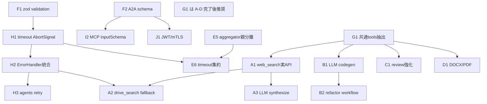

# ワークツリー並行開発設計

## 目的

現行ワークツリー（`src/`）を関心領域ごとに洗い出し、**ディレクトリ所有権が被らない Issue** に分割する。  
各 Issue は独立した **git worktree + feature branch** で並行実装できる。

## 現状サマリ

| 領域 | 状態 | 並行可否 |
|------|------|----------|
| types / protocol | 骨格完了、バリデーション未整備 | Foundation（先行） |
| orchestrator | 動作するが Conditional/Hierarchical は簡略 | Foundation 後に並行可 |
| agents/* | 4 エージェント独立。中身はモック多い | **互いに並行可** |
| utils / core | timeout・ErrorHandler 未配線 | agents と要調整 |
| mcp | 薄いラッパー | agents API 安定後 |
| tests | ほぼ無し | モジュール単位で並行可 |
| security / observability | 未実装 | 後続フェーズ |

## Worktree 運用ルール

### ブランチ / worktree 命名

```
branch:   cursor/<track>-<short-slug>-acf1
worktree: ../subagent-<track>-<short-slug>
```

例:

```bash
git worktree add -b cursor/research-web-search-acf1 \
  ../subagent-research-web-search master
```

### ディレクトリ所有権（衝突回避）

| Track | 所有パス | 同時編集禁止 |
|-------|----------|--------------|
| F Foundation | `src/types/`, `src/protocol/` | E/J の型変更と同時禁止 |
| E Orchestrator | `src/orchestrator/` | F 進行中はマージのみ |
| H Resilience | `src/core/`, `src/utils/` | agents の execute 差し替えと要 PR 順 |
| A Research | `src/agents/research/` | — |
| B CodeGen | `src/agents/codegen/` | — |
| C Review | `src/agents/review/` | — |
| D Document | `src/agents/document/` | — |
| G Shared tools | `src/tools/`（新規） | A–D 完了後、または freeze 後 |
| I MCP | `src/mcp/` | — |
| J Security | `src/security/`（新規）+ protocol | F 完了後 |
| L Observability | `src/utils/logger.ts` + `src/obs/`（新規） | — |
| K Tests | `tests/` または `src/**/*.test.ts` | 対象モジュールの API 安定後 |

### マージ順序

```
F → (E ∥ H ∥ K-protocol)
  → (A ∥ B ∥ C ∥ D)
  → G
  → (I ∥ J ∥ L)
  → K（残テスト）
```

### PR 規約

- 1 Issue = 1 worktree = 1 PR
- PR タイトルに `[track-X]` と Issue ID を含める
- 所有パス外の変更は原則禁止（必要な場合は依存 Issue を先にマージ）
- Foundation（F）は他 PR より優先マージ

## 依存グラフ



※ G1 は A–D と衝突しやすいため、エージェント実装後にまとめて抽出する。

## Issue 一覧（並行トラック）

詳細は [`docs/issues/`](./issues/) および GitHub Issues。再作成用: `scripts/create-github-issues.sh`。

| ID | GH | Track | タイトル | 依存 | 並行グループ |
|----|----|-------|----------|------|--------------|
| F-1 | [#1](https://github.com/take566/subagent/issues/1) | F | SubagentConfig 入力バリデーションを zod で実装 | — | Wave0 |
| F-2 | [#16](https://github.com/take566/subagent/issues/16) | F | A2A メッセージの厳密スキーマと型ガード | — | Wave0 |
| E-1 | [#11](https://github.com/take566/subagent/issues/11) | E | Conditional 条件評価の拡張 | F-1 任意 | Wave1 |
| E-2 | [#12](https://github.com/take566/subagent/issues/12) | E | Hierarchical を入れ子 Subagent 制御に対応 | core spawn | Wave1 |
| E-3 | [#13](https://github.com/take566/subagent/issues/13) | E | ResultAggregator の親/子分離ロジック修正 | — | Wave1 |
| E-4 | [#14](https://github.com/take566/subagent/issues/14) | E | selectSubagent を capability ベースに変更 | — | Wave1 |
| E-5 | [#15](https://github.com/take566/subagent/issues/15) | E | 実行タイムアウトと partial failure の集約 | H-1 | Wave2 |
| H-1 | [#18](https://github.com/take566/subagent/issues/18) | H | behavior.timeout を AbortSignal で強制 | — | Wave1 |
| H-2 | [#19](https://github.com/take566/subagent/issues/19) | H | ErrorHandler を Subagent.execute に統合 | H-1 | Wave2 |
| H-3 | [#20](https://github.com/take566/subagent/issues/20) | H | CodeGen/Review/Document で RetryManager 利用 | H-2 | Wave3 |
| A-1 | [#2](https://github.com/take566/subagent/issues/2) | A | web_search / web_fetch の実 API 接続 | — | Wave2 |
| A-2 | [#3](https://github.com/take566/subagent/issues/3) | A | drive_search とフォールバック配線 | A-1, H-2 | Wave3 |
| A-3 | [#4](https://github.com/take566/subagent/issues/4) | A | LLM ベース synthesize / confidence | A-1 | Wave3 |
| B-1 | [#5](https://github.com/take566/subagent/issues/5) | B | LLM によるコード生成パイプライン | — | Wave2 |
| B-2 | [#6](https://github.com/take566/subagent/issues/6) | B | リファクタ / str_replace ワークフロー | B-1 | Wave3 |
| C-1 | [#7](https://github.com/take566/subagent/issues/7) | C | criteria 対応の静的解析・セキュリティ強化 | — | Wave2 |
| C-2 | [#8](https://github.com/take566/subagent/issues/8) | C | Lint 出力パーサの言語別対応 | — | Wave2 |
| D-1 | [#9](https://github.com/take566/subagent/issues/9) | D | DOCX / PDF 出力サポート | — | Wave2 |
| D-2 | [#10](https://github.com/take566/subagent/issues/10) | D | Notion tools 統合 | — | Wave2 |
| G-1 | [#17](https://github.com/take566/subagent/issues/17) | G | FileCreate/Bash/View を共通モジュールへ抽出 | A–D 安定後 | Wave4 |
| I-1 | [#21](https://github.com/take566/subagent/issues/21) | I | AGENT_ID / MAX_CONCURRENT 環境変数反映 | — | Wave4 |
| I-2 | [#22](https://github.com/take566/subagent/issues/22) | I | ツールスキーマを MCP inputSchema として公開 | F-2 | Wave4 |
| J-1 | [#23](https://github.com/take566/subagent/issues/23) | J | A2A 認証（JWT/mTLS）と認可 | F-2 | Wave4 |
| J-2 | [#24](https://github.com/take566/subagent/issues/24) | J | 出力サニタイズとレート制限 | I-1 | Wave5 |
| L-1 | [#29](https://github.com/take566/subagent/issues/29) | L | task_id / correlation_id 付き構造化ログ | — | Wave4 |
| L-2 | [#30](https://github.com/take566/subagent/issues/30) | L | duration histogram / success rate / tracing | L-1 | Wave5 |
| K-1 | [#25](https://github.com/take566/subagent/issues/25) | K | orchestrator / planner / aggregator テスト | E 安定後 | Wave1+ |
| K-2 | [#26](https://github.com/take566/subagent/issues/26) | K | A2A / Retry / ErrorHandler テスト | — | Wave1 |
| K-3 | [#27](https://github.com/take566/subagent/issues/27) | K | 各 Agent のモックツール結合テスト | A–D 安定後 | Wave3+ |
| K-4 | [#28](https://github.com/take566/subagent/issues/28) | K | MCP Server ListTools / CallTool テスト | I 安定後 | Wave4+ |

## Wave 実行イメージ（最大並列度）

| Wave | 同時 worktree 数 | 内容 |
|------|------------------|------|
| 0 | 2 | F-1, F-2 |
| 1 | 6–8 | E-1〜4, H-1, K-1/K-2 |
| 2 | 6 | A-1, B-1, C-1, C-2, D-1, D-2（+ E-5, H-2） |
| 3 | 4 | A-2, A-3, B-2, H-3, K-3 |
| 4 | 5 | G-1, I-1, I-2, J-1, L-1 |
| 5 | 2 | J-2, L-2, K-4 |

## 受け入れ条件（全 Issue 共通）

1. 所有パス以外を変更していない（やむを得ない場合は依存を Issue 本文に記載）
2. `npm run build` が通る
3. 追加したテストがあれば `npm test` が通る
4. README / CHANGELOG はドキュメント Issue 以外では触らない（衝突回避）

---

*Document Version: 1.0.0*  
*Derived from: subagent-design-document.md + src/ inventory*
